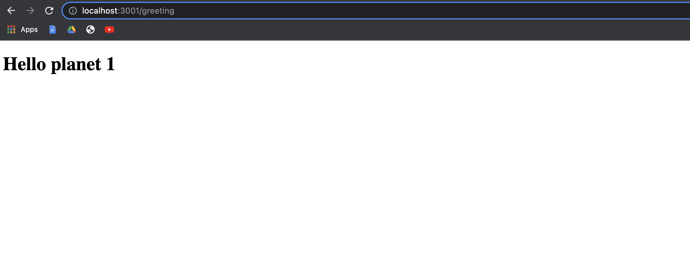

# Set up a "Hello world" project with two apps(front end)

> Hello React App frontend



## Built With

- React & Redux

## Getting Started

To get a local copy up and running follow these simple example steps.

### Prerequisites

- NodeJS - [v16.x](https://nodejs.org/en/)
- Yarn

### Setup

```bash
git clone https://github.com/Ghiftee/hello-react-front-end.git
cd ./hello-react-front-end
```

### Install

```bash
npm install
```

### Usage

```bash
npm start
```

## Author

👤 **Gift Uwhubetine**

- GitHub: [@Ghiftee](https://github.com/ghiftee)
- Twitter: [@Ghiftee](https://twitter.com/i_ghiftee)
- LinkedIn: [Ghiftee](https://linkedin.com/in/giftuwhubetine)

## 🤝 Contributing

Contributions, issues, and feature requests are welcome!

Feel free to check the [issues page](../../issues/).

## Show your support

Give a ⭐️ if you like this project!

## Acknowledgments

- Microverse

## 📝 License

This project is [MIT](./LICENSE.md) licensed.